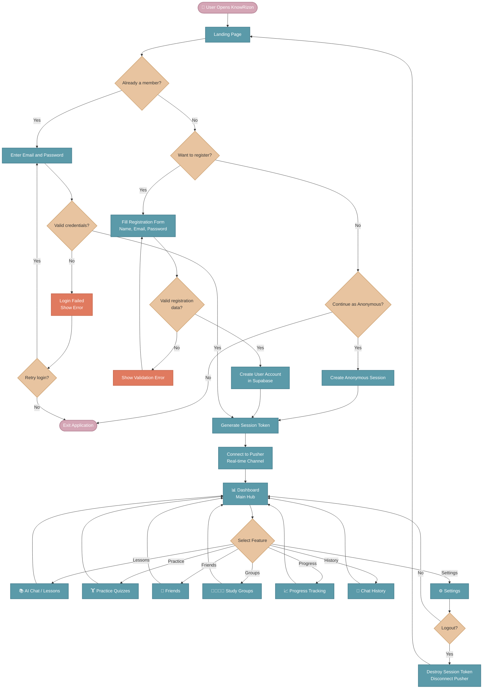
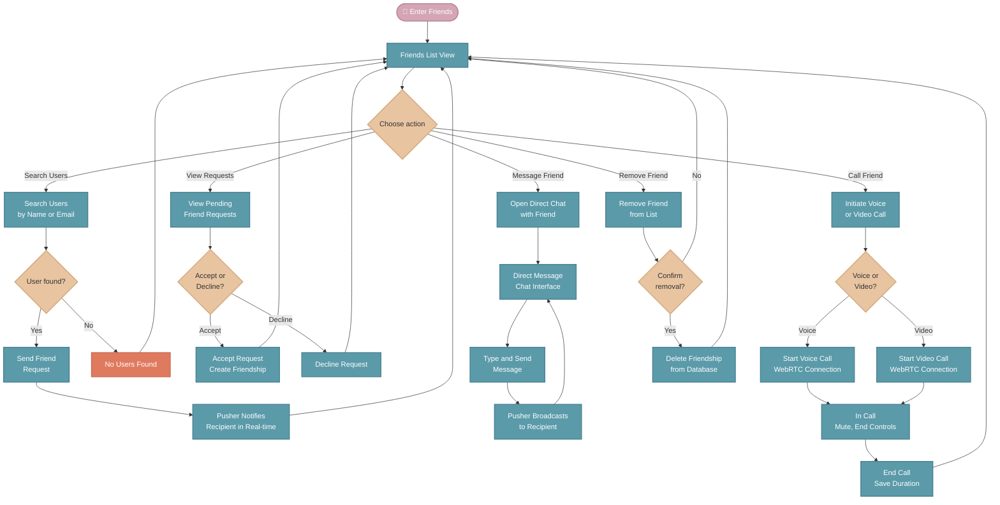
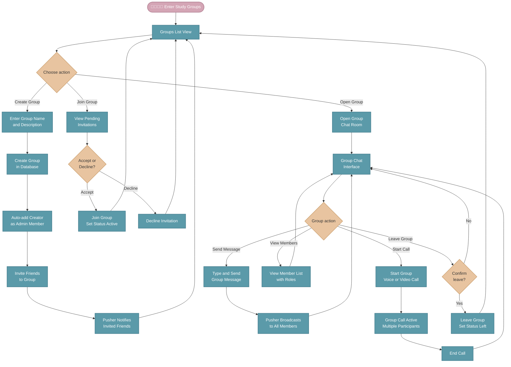

# KnowRizon AI — User Flowchart

> [!NOTE]
> Complete user journey flowchart matching the reference style with colored nodes.
> Paste each flowchart into [mermaid.ai](https://mermaid.ai) one at a time.

---

## 🔄 Flowchart 1 — Main User Journey (Full Overview)

---

## 📚 Flowchart 2 — AI Chat / Lessons Flow

```mermaid
flowchart TD
    ENTER([📚 Enter Lessons])
    ENTER --> HAS_CONV{Existing\nconversation?}

    HAS_CONV -->|Yes| SELECT_CONV[Select Conversation\nfrom History]
    HAS_CONV -->|No| NEW_CONV[Start New\nConversation]

    SELECT_CONV --> LOAD_MSGS[Load Previous\nMessages]
    LOAD_MSGS --> CHAT_VIEW
    NEW_CONV --> CHAT_VIEW[Chat Interface]

    CHAT_VIEW --> HAS_CONTENT{Upload content\nfirst?}
    HAS_CONTENT -->|Yes| UPLOAD[Upload PDF / Video / Image]
    HAS_CONTENT -->|No| TYPE_MSG[Type Question\nor Message]

    UPLOAD --> PROCESS{Content\nprocessing}
    PROCESS -->|Success| EXTRACT[AI Extracts Title,\nSummary, Key Points]
    PROCESS -->|Failed| UPLOAD_ERR[Show Processing Error]
    UPLOAD_ERR --> CHAT_VIEW

    EXTRACT --> CONTEXT_READY[Content Context\nAvailable]
    CONTEXT_READY --> TYPE_MSG

    TYPE_MSG --> SEND[Send Message to\nTutorAgent API]
    SEND --> AI_RESP{AI Response\nreceived?}
    AI_RESP -->|Yes| DISPLAY[Display AI Response\nwith Markdown]
    AI_RESP -->|No| AI_ERR[Show Error\nRetry Available]
    AI_ERR --> TYPE_MSG

    DISPLAY --> SAVE_DB[Save to Conversation\nHistory in DB]
    SAVE_DB --> CONTINUE{Continue\nchatting?}
    CONTINUE -->|Yes| TYPE_MSG
    CONTINUE -->|No| BACK([Return to Dashboard])

    style ENTER fill:#d4a5b5,stroke:#b8899a,color:#fff,stroke-width:2px
    style BACK fill:#d4a5b5,stroke:#b8899a,color:#fff,stroke-width:2px
    style HAS_CONV fill:#e8c4a0,stroke:#d1a87a,color:#333,stroke-width:2px
    style HAS_CONTENT fill:#e8c4a0,stroke:#d1a87a,color:#333,stroke-width:2px
    style PROCESS fill:#e8c4a0,stroke:#d1a87a,color:#333,stroke-width:2px
    style AI_RESP fill:#e8c4a0,stroke:#d1a87a,color:#333,stroke-width:2px
    style CONTINUE fill:#e8c4a0,stroke:#d1a87a,color:#333,stroke-width:2px
    style SELECT_CONV fill:#5b9aa9,stroke:#4a8292,color:#fff,stroke-width:2px
    style NEW_CONV fill:#5b9aa9,stroke:#4a8292,color:#fff,stroke-width:2px
    style LOAD_MSGS fill:#5b9aa9,stroke:#4a8292,color:#fff,stroke-width:2px
    style CHAT_VIEW fill:#5b9aa9,stroke:#4a8292,color:#fff,stroke-width:2px
    style UPLOAD fill:#5b9aa9,stroke:#4a8292,color:#fff,stroke-width:2px
    style EXTRACT fill:#5b9aa9,stroke:#4a8292,color:#fff,stroke-width:2px
    style CONTEXT_READY fill:#5b9aa9,stroke:#4a8292,color:#fff,stroke-width:2px
    style TYPE_MSG fill:#5b9aa9,stroke:#4a8292,color:#fff,stroke-width:2px
    style SEND fill:#5b9aa9,stroke:#4a8292,color:#fff,stroke-width:2px
    style DISPLAY fill:#5b9aa9,stroke:#4a8292,color:#fff,stroke-width:2px
    style SAVE_DB fill:#5b9aa9,stroke:#4a8292,color:#fff,stroke-width:2px
    style UPLOAD_ERR fill:#e07a5f,stroke:#c96a50,color:#fff,stroke-width:2px
    style AI_ERR fill:#e07a5f,stroke:#c96a50,color:#fff,stroke-width:2px
```

---

## 🏋️ Flowchart 3 — Practice / Quiz Flow

```mermaid
flowchart TD
    ENTER([🏋️ Enter Practice])
    ENTER --> HAS_MATERIAL{Uploaded content\navailable?}

    HAS_MATERIAL -->|Yes| SELECT_TOPIC[Select Topic from\nUploaded Content]
    HAS_MATERIAL -->|No| ENTER_TOPIC[Enter Custom\nTopic Manually]

    SELECT_TOPIC --> SET_COUNT[Set Number of\nQuestions: 5-20]
    ENTER_TOPIC --> SET_COUNT

    SET_COUNT --> GENERATE[QuizAgent Generates\nQuestions via AI]
    GENERATE --> GEN_CHECK{Quiz generated\nsuccessfully?}

    GEN_CHECK -->|No| FALLBACK[Show Fallback\nPlaceholder Quiz]
    GEN_CHECK -->|Yes| SHOW_QUIZ[Display Quiz\nInterface]
    FALLBACK --> SHOW_QUIZ

    SHOW_QUIZ --> ANSWER[User Selects\nAnswer Option]
    ANSWER --> NEXT{More questions\nremaining?}
    NEXT -->|Yes| SHOW_QUIZ
    NEXT -->|No| SUBMIT[Submit All Answers]

    SUBMIT --> CALCULATE[Calculate Score\nand Percentage]
    CALCULATE --> RESULTS[Display Results\nScore, Explanations]
    RESULTS --> SAVE[Save Quiz Result\nto Database]
    SAVE --> REVIEW{Review\nanswers?}

    REVIEW -->|Yes| EXPLANATIONS[Show Correct Answers\nwith Explanations]
    REVIEW -->|No| AGAIN{Take another\nquiz?}
    EXPLANATIONS --> AGAIN

    AGAIN -->|Yes| HAS_MATERIAL
    AGAIN -->|No| BACK([Return to Dashboard])

    style ENTER fill:#d4a5b5,stroke:#b8899a,color:#fff,stroke-width:2px
    style BACK fill:#d4a5b5,stroke:#b8899a,color:#fff,stroke-width:2px
    style HAS_MATERIAL fill:#e8c4a0,stroke:#d1a87a,color:#333,stroke-width:2px
    style GEN_CHECK fill:#e8c4a0,stroke:#d1a87a,color:#333,stroke-width:2px
    style NEXT fill:#e8c4a0,stroke:#d1a87a,color:#333,stroke-width:2px
    style REVIEW fill:#e8c4a0,stroke:#d1a87a,color:#333,stroke-width:2px
    style AGAIN fill:#e8c4a0,stroke:#d1a87a,color:#333,stroke-width:2px
    style SELECT_TOPIC fill:#5b9aa9,stroke:#4a8292,color:#fff,stroke-width:2px
    style ENTER_TOPIC fill:#5b9aa9,stroke:#4a8292,color:#fff,stroke-width:2px
    style SET_COUNT fill:#5b9aa9,stroke:#4a8292,color:#fff,stroke-width:2px
    style GENERATE fill:#5b9aa9,stroke:#4a8292,color:#fff,stroke-width:2px
    style SHOW_QUIZ fill:#5b9aa9,stroke:#4a8292,color:#fff,stroke-width:2px
    style ANSWER fill:#5b9aa9,stroke:#4a8292,color:#fff,stroke-width:2px
    style SUBMIT fill:#5b9aa9,stroke:#4a8292,color:#fff,stroke-width:2px
    style CALCULATE fill:#5b9aa9,stroke:#4a8292,color:#fff,stroke-width:2px
    style RESULTS fill:#5b9aa9,stroke:#4a8292,color:#fff,stroke-width:2px
    style SAVE fill:#5b9aa9,stroke:#4a8292,color:#fff,stroke-width:2px
    style EXPLANATIONS fill:#5b9aa9,stroke:#4a8292,color:#fff,stroke-width:2px
    style FALLBACK fill:#e07a5f,stroke:#c96a50,color:#fff,stroke-width:2px
```

---

## 👥 Flowchart 4 — Friends & Social Flow

---

## 👨‍👩‍👧‍👦 Flowchart 5 — Study Groups Flow

---

## 🎨 Color Legend

| Color | Shape | Meaning |
|---|---|---|
| 🩷 **Pink** `#d4a5b5` | Rounded rectangle | Start / End / Entry points |
| 🟠 **Peach** `#e8c4a0` | Diamond | Decision points (Yes / No) |
| 🔵 **Teal** `#5b9aa9` | Rectangle | Process / Action steps |
| 🔴 **Coral** `#e07a5f` | Rectangle | Error / Failure states |
